# IESB Development Analysis System Infrastructure

Infrastructure as Code for the Development Analysis System course at IESB University.

## Architecture

```mermaid
graph TB
    User[👤 Students] --> ADS[🌐 ads.dataiesb.com]
    ADS --> IDE[💻 IDE Pod<br/>Code Server + kubectl<br/>Pre-configured for EKS]
    
    subgraph EKS[EKS Cluster - Training Environment]
        IDE
        PROD[🚀 Production Apps<br/>Deployed by Students]
    end
    
    IDE -.->|kubectl deploy| PROD
    
    classDef user fill:#4caf50,stroke:#fff,stroke-width:2px,color:#fff
    classDef ide fill:#326ce5,stroke:#fff,stroke-width:2px,color:#fff
    classDef prod fill:#ff9900,stroke:#fff,stroke-width:2px,color:#fff
    
    class User user
    class IDE ide
    class PROD prod
```



### AWS Infrastructure Details


- **VPC**: Custom 10.0.0.0/16 network with public subnets
- **EKS**: Managed Kubernetes cluster (v1.30) 
- **IDE**: Cloud-based development environment
- **DNS**: ads.dataiesb.com domain configuration

## Folder Structure

```
├── terraform/          # Infrastructure as Code
│   ├── modules/        # Reusable Terraform modules
│   │   ├── vpc/       # VPC module
│   │   └── eks/       # EKS module
│   ├── policies/      # IAM and security policies
│   └── *.tf          # Main Terraform configuration
├── kubernetes/        # Kubernetes deployments
│   └── ide-deployment/ # IDE container deployment
└── docs/            # Documentation
```

## Components

### Infrastructure (Terraform)
- EKS cluster with node groups
- VPC with Internet Gateway and routing
- Security groups and IAM roles
- Route 53 DNS configuration

### IDE Deployment (Kubernetes)
- Code Server with development tools
- 50GB GP3 EBS persistent storage
- Docker, kubectl, AWS CLI, eksctl
- Load balancer with public access
- Secrets Store CSI Driver for AWS Secrets Manager integration

## Quick Start

1. **Deploy Infrastructure**:
   ```bash
   cd terraform
   terraform init
   terraform apply
   ```

2. **Deploy IDE**:
   ```bash
   cd kubernetes/ide-deployment
   kubectl apply -f .
   ```

3. **Access IDE**: http://ads.dataiesb.com

## Management

- **Update secrets**: `./kubernetes/ide-deployment/update-secret.sh`
- **Get password**: Stored in AWS Secrets Manager `ide-password`
- **Kubectl context**: Pre-configured for `default` namespace

### Secrets Store CSI Driver

The deployment uses the AWS Secrets Store CSI Driver to securely retrieve the IDE password from AWS Secrets Manager. The CSI driver configuration is included in the Kubernetes manifests:

- `14-secrets-store-csi.yaml`: SecretProviderClass configuration
- Automatically syncs secrets from AWS Secrets Manager to Kubernetes secrets
- IDE deployment mounts secrets via CSI volume and environment variables

## Course Context

This infrastructure supports the Development Analysis System course, providing students with a cloud-based development environment for data analysis and system development projects.
