# IESB Development Analysis System - Architecture Diagram

## Infrastructure Overview

```mermaid
graph TB
    User[👤 Students] --> ADS[🌐 ads.dataiesb.com]
    ADS --> IDE[💻 IDE Pod<br/>Code Server + kubectl<br/>Pre-configured for EKS]
    
    subgraph EKS[EKS Cluster - Training Environment]
        IDE
        PROD[🚀 Production Apps<br/>Deployed by Students]
    end
    
    IDE -.->|kubectl deploy| PROD
    
    classDef user fill:#4caf50,stroke:#fff,stroke-width:2px,color:#fff
    classDef ide fill:#326ce5,stroke:#fff,stroke-width:2px,color:#fff
    classDef prod fill:#ff9900,stroke:#fff,stroke-width:2px,color:#fff
    
    class User user
    class IDE ide
    class PROD prod
```

## Repository Structure

## Deployment Flow

## Key Components

### Infrastructure (Terraform)
- **VPC Module**: Custom 10.0.0.0/16 network with public subnets
- **EKS Module**: Managed Kubernetes cluster v1.30 with node groups
- **IAM**: Service accounts, OIDC provider, ALB controller permissions
- **ECR**: Container registry for IDE images

### Kubernetes Deployments
- **AWS Load Balancer Controller**: Manages ALB for ingress
- **Secrets Store CSI Driver**: Integrates with AWS Secrets Manager
- **IDE Deployment**: Code Server with development tools
- **Persistent Storage**: 50GB GP3 EBS volume for user data

### DNS & Security
- **Route 53**: DNS management for ads.dataiesb.com
- **ACM Certificate**: SSL/TLS encryption
- **Security Groups**: Network access control
- **IAM Roles**: Fine-grained permissions with IRSA

## Access Information
- **URL**: https://ads.dataiesb.com
- **Password**: Stored in AWS Secrets Manager (`ide-password`)
- **Tools**: Docker, kubectl, AWS CLI, eksctl pre-installed
